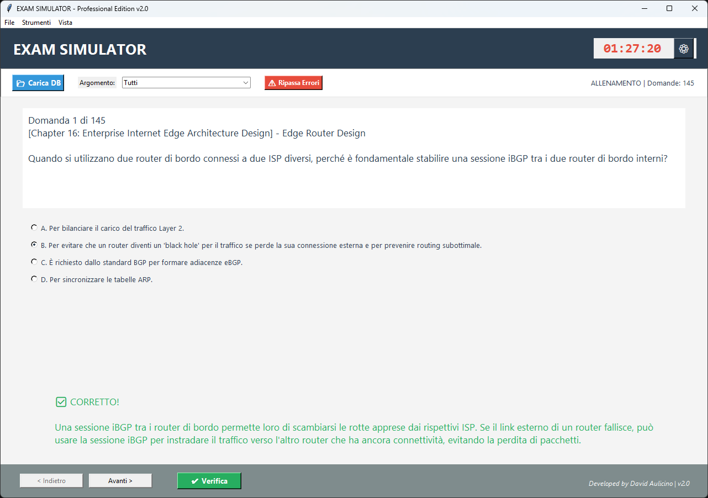

# 🎓 Exam Simulator - Professional Edition v3.0

**Un simulatore d'esame desktop moderno, portatile e potente per prepararsi alle certificazioni IT (Cisco, CompTIA, ecc.).**

*(Suggerimento: Carica uno screenshot della nuova interfaccia e chiamalo screenshot.png)*

## 📖 Descrizione

Questo repository contiene l'applicazione e i database delle domande per **Exam Simulator v3.0**.
Il software è stato completamente riscritto per offrire un'interfaccia moderna, statistiche avanzate e strumenti di studio mirati.

Non è necessaria alcuna installazione complessa: scarica, avvia e inizia ad esercitarti.

### 📦 Database Inclusi
* **CCNA 200-301**: Networking Fundamentals, IP, Switching, Security, Automation.
* **CCNP ENSLD 300-420**: Enterprise Design, Advanced Addressing, WAN, SD-Access, SD-WAN.
* **CCDE 400-007**: Expert Design Scenarios.
* **Modelli CSV/JSON**: File di esempio per creare i propri test.

---

## ✨ Novità della v3.0

* **🎨 Modern UI:** Nuova interfaccia grafica basata su *CustomTkinter* con supporto nativo per temi Chiari/Scuri.
* **📈 Storico & Database:** I tuoi risultati vengono salvati automaticamente. Tieni traccia dei tuoi progressi nel tempo tramite la scheda "Storico".
* **🎯 Studio Mirato:** Seleziona specifici capitoli su cui esercitarti (es. solo "OSPF" o "SD-WAN") invece di dover affrontare tutto il database.
* **📊 Barra di Progresso:** Feedback visivo immediato durante l'esame.

### Altre Funzionalità
* **🚀 Portatile:** Nessuna installazione richiesta.
* **📄 Supporto Multi-Formato:** Carica nativamente file **JSON** e **CSV**.
* **⏱️ Timer & Modalità:**
    * **Modalità Esame:** Feedback nascosto fino alla fine, timer attivo.
    * **Modalità Allenamento:** Feedback immediato per ogni risposta.
* **🛠️ Editor Integrato:** Crea nuove domande, aggiungile a una lista e **esporta** il tutto in un nuovo file JSON condivisibile.
* **🔀 Shuffle Avanzato:** Mischia domande e risposte per evitare la memorizzazione visiva.

---

## 🚀 Come Iniziare

1.  Vai nella sezione **Releases** o scarica l'eseguibile/script da questo repository.
2.  Scarica i file delle domande (es. `batch_ccnp_ensld.json`).
3.  Avvia `ExamSimulator.exe` (o `exam_simulator_v3.py` se usi Python).
4.  Clicca su **📂 Carica Database** e seleziona il file JSON o CSV.
5.  Nella colonna di destra, **seleziona i capitoli** che vuoi studiare.
6.  Premi **🚀 Avvia Simulazione**.

---

## 📝 Come creare i propri esami

Puoi espandere il simulatore creando i tuoi quiz personali in tre modi:

### Metodo 1: Editor Integrato (Novità v3.0) 🛠️
1.  Apri il programma e vai alla scheda **🛠 Editor & Export**.
2.  Compila i campi (Capitolo, Domanda, Opzioni, Risposta Corretta).
3.  Clicca su **➕ Aggiungi alla Lista**.
4.  Quando hai finito, clicca su **💾 Esporta in JSON** per salvare il tuo nuovo database.

### Metodo 2: Usare Excel / CSV 📊
Crea un file CSV con le seguenti colonne:
`Capitolo`, `Argomento`, `Domanda`, `A`, `B`, `C`, `D`, `Risposta`, `Spiegazione`

**Esempio:**
| Capitolo | Argomento | Domanda | A | B | C | D | Risposta | Spiegazione |
| :--- | :--- | :--- | :--- | :--- | :--- | :--- | :--- | :--- |
| Cap 1 | Reti | Cos'è un IP? | Un cavo | Un indirizzo | Un PC | Un virus | B | L'IP è logico. |
| Cap 1 | Sicurezza | Protocolli? | Telnet | SSH | HTTP | HTTPS | B,D | SSH/HTTPS criptano. |

### Metodo 3: Formato JSON (Per sviluppatori) 💻
Struttura supportata:

[
  {
    "id": "1",
    "capitolo": "Routing",
    "argomento": "OSPF",
    "tipo": "singola",
    "domanda": "Qual è la distanza amministrativa di OSPF?",
    "opzioni": [
      "A. 90",
      "B. 110",
      "C. 120",
      "D. 170"
    ],
    "risposta_corretta": "B",
    "spiegazione": "La AD di OSPF è 110."
  },
  {
    "id": "2",
    "capitolo": "Switching",
    "argomento": "VLAN",
    "tipo": "multipla",
    "domanda": "Quali comandi creano una VLAN?",
    "opzioni": [
      "A. vlan 10",
      "B. interface vlan 10",
      "C. switchport access",
      "D. name SALES"
    ],
    "risposta_corretta": [
      "A",
      "D"
    ],
    "spiegazione": "Serve definire ID e nome."
  }
]

## 👨‍💻 Credits

**Developed by David Aulicino**
*Versione Software: 3.0*

Questo software è freeware e distribuito gratuitamente per scopi educativi.
